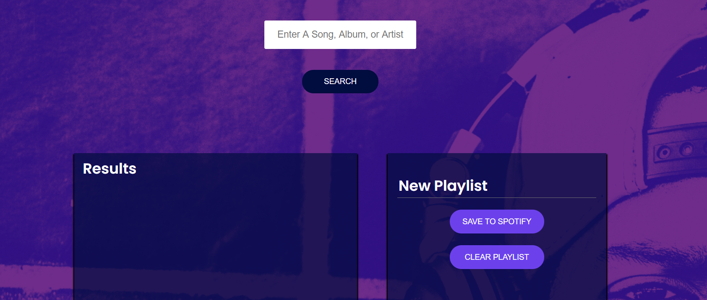
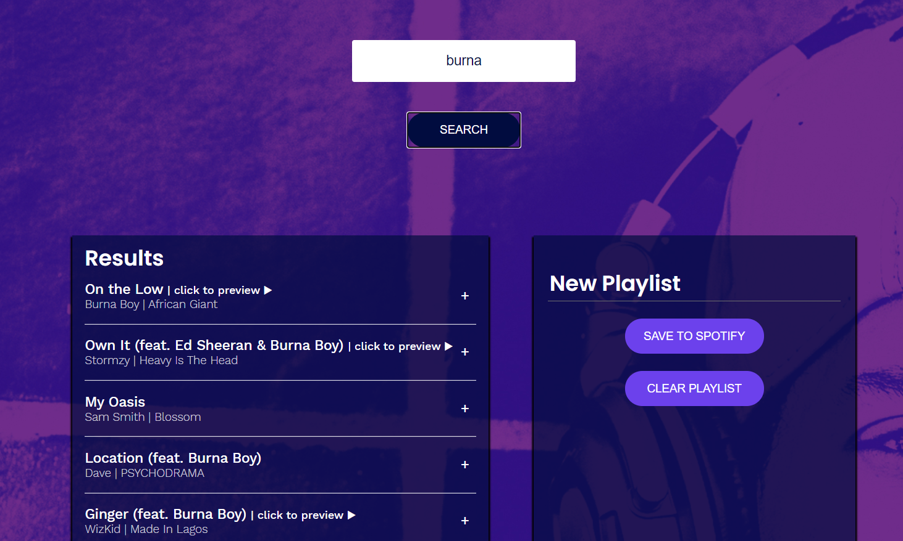
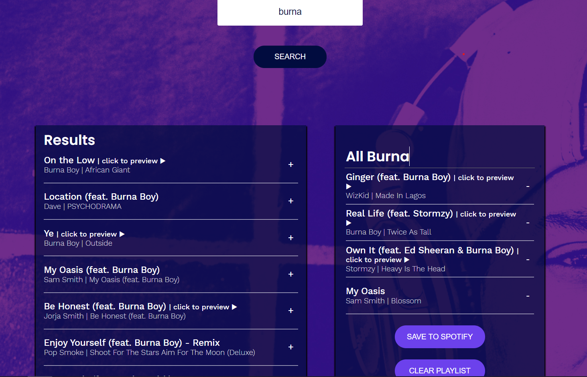
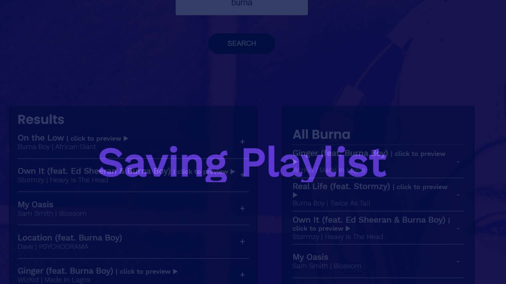
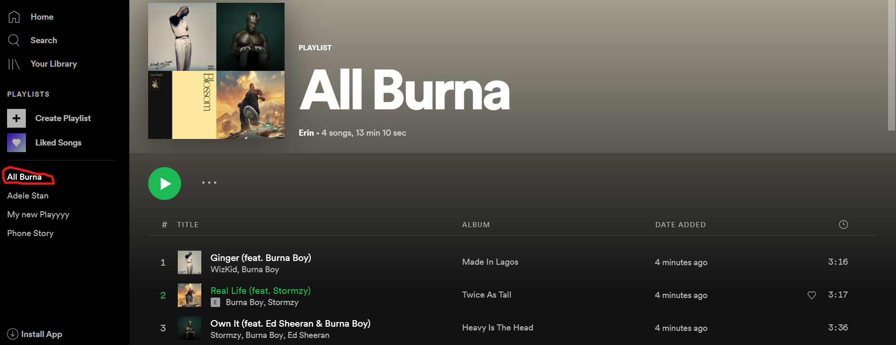

# Jammming  

> A website that allows users to search the Spotify library, create a custom playlist, then save it to their Spotify account.

## Table of contents  

  - [General info](#general-info)
  - [Screenshots](#screenshots)
  - [Technologies](#technologies)
  - [Setup](#setup)
  - [Features](#features)
  - [Status](#status)
  - [Inspiration](#inspiration)
  - [Contact](#contact)

## General info  

 A website that allows users to search the Spotify library, create a custom playlist, then save it to their Spotify account. A remake of a previous project written using class components, did this remake to practice using functional components, hooks, testing using jest and enzyme, writing code with accessibility in mind and writing a good README document.

## Screenshots  

## Technologies  

- "@testing-library/jest-dom": "^5.11.4"  
- "@testing-library/react": "^11.1.0"
- "@testing-library/user-event": "^12.1.10"
- "base64-arraybuffer": "^0.2.0"
- "crypto-random-string": "^3.3.0"
- "react": "^17.0.1"
- "react-dom": "^17.0.1"
- "react-router-dom": "^5.2.0"
- "react-scripts": "4.0.1"
- "web-vitals": "^0.2.4"
- "@wojtekmaj/enzyme-adapter-react-17": "^0.3.1"
- "enzyme": "^3.11.0"
- "enzyme-adapter-react-16": "^1.15.5"
- "react-test-renderer": "^17.0.1"

## Setup  

Visit [Jammming](https://www.jammming.netlify.app) in your browser.

## Features  

- Search Spotify Music Library
- Listen to Audio Preview Samples of Songs
- Create A New Playlist, Add Tracks to it and Save to your Spotify Playlists

## Status  

Project is: _finished_

## Inspiration  

This project was inspired by codecademy's full stack developer path, a practice project to test react, http requests, javascript, html and css skills.

## Contact  

Created by [@funmilolajire](mailto:funmilolajire@gmail.com) - feel free to contact me!  
